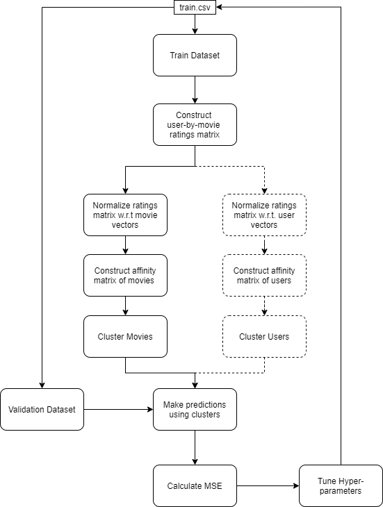

# collaborative-filtering
   
> 
> Netflix rating prediction using collaborative filtering based on spectral clustering.
### Spectral Clustering Overview:
In Multivariate statistics and the clustering of data, [**spectral clustering**]([https://en.wikipedia.org/wiki/Spectral_clustering](https://en.wikipedia.org/wiki/Spectral_clustering)) techniques make use of the spectrum (eigenvalues) of the similarity matrix of the data to perform dimensionality reduction before clustering in fewer dimensions. The similarity matrix is provided as an input and consists of a quantitative assessment of the relative similarity of each pair of points in the dataset. 

### Approach and Walkthrough
This approach works by using Spectral Clustering on the training data to cluster movies that are similarly                 rated and users that have similar rating behaviors and make further predictions on the ratings of                unknown user-movie pairs using the information inferred from similarly rated movies and users with              similar rating behaviors, obtained from the clustering. The similarity is calculated using centered cosine              distances. Overall this approach achieves a mean squared error (MSE) of 0.95 on an average when cross                 validation is performed on the training data set. Note that for the clustering, the similarity between                entities is calculated only on the basis of the rating a user gives to a movie, this process is also known as collaborative filtering. The fundamental assumption under collaborative filtering is that if the users share similar ratings in the past on the same set of items, then they would likely rate the other items similarly​ [[1]](https://ieeexplore.ieee.org/document/8400447)​. 
The below flowcharts give a detailed walkthrough of both the training and prediction phases.  

    
 Flowchart 1: Training + Validation process

    
 Flowchart 2: Rating Prediction Process 

We begin by constructing a user-by-movie matrix $R$ that holds the ratings obtained from the training dataset and normalizing this ratings matrix to $R_{Norm}$ with respect to movies, i.e. along the columns of the matrix by mean centering. Then we construct an affinity matrix $A_{movie}$ by calculating the pairwise cosine distances of the columns of the ratings matrix. We then run spectral clustering algorithm on the movies with $k = 10$ to obtain clusters of similarly rated movies. Using these clusters, we make a prediction on the data points from the validation/test dataset. The predictions are based on a weighted mean of the ratings of $p=10$ nearest neighbors from the clusters corresponding to a particular movie-id and customer-id, the weights are the similarity values calculated earlier. We perform ten fold cross validation while tuning hyper parameters. Overall this approach achieves a mean squared error(MSE) of 0 .91.
 
The user clustering branch is drawn with a dotted line because even though we calculate these                components, we do not make the final predictions using them, the reasons for such design choices and                 other hyper parameter related tuning details will be listed in the next section. 
 
Normalizing ratings matrices: The user-by-movie ratings matrix is normalized in such a way that the mean is centered around zero. In order to achieve that, we calculate the mean for each column and subtract the non-zero elements in the column with the mean, the zero elements remain unchanged. We perform the same operation for clustering users, instead of columns, we center rows for this case. The centered mean vectors (mean becomes zero) perform much better in capturing the similarity between two entities as zeros no longer weigh-in while calculating cosine similarity. 
 
Affinity Matrix: The cosine similarity lies between -1 and 1, so we add 1 to all the elements in the affinity matrix to shift the range of the similarities from 0 to 2 so that all the affinity values remain positive. This 
transformation seemed to perform better for clustering in experimental observations. We also tried other transformations on the affinity matrix such as taking a square of the elements in the matrix and even square root, they don’t seem to have much impact on the clustering performance in movies. While linearly scaling the matrix had an impact on the clusters formed on customers, multiplying the matrix with 1000 yielded clusters with much more balance in the cluster sizes. 
 
Number of clusters ($k$): The number of clusters was selected empirically based on the size of the clusters,                  we try to keep the size of clusters fairly balanced. The number of clusters did not have a massive effect                    on the mse value, the metric we use to evaluate the performance of the model. Below is a brief plot                    which shows the varying mse with the number of clusters. Here, ratings were predicted on a validation                 dataset using the weighted mean of all the movies in a cluster. 
 
Number of nearest neighbours ($p$): The approaches of taking the mean of all the movies in a movie                  cluster or a combination of the means of all the movies in a movie cluster and means of all the users in a                       user cluster yielded satisfactory results but to improve upon this, we perform a weighted mean of p                 nearest neighbours nearest neighbors from the clusters corresponding to a particular movie-id. The             clustering helps massively here because the search space for finding the nearest neighbours is reduced               considerably, the above decision to maintain the balance in the cluster sizes is mainly because of this reason. We do not want to have a large value of p because since we are using a weighted mean, the farther neighbours have negligible impact on the prediction. Below is a brief plot of varying mse with the choice of p. 
 
 
